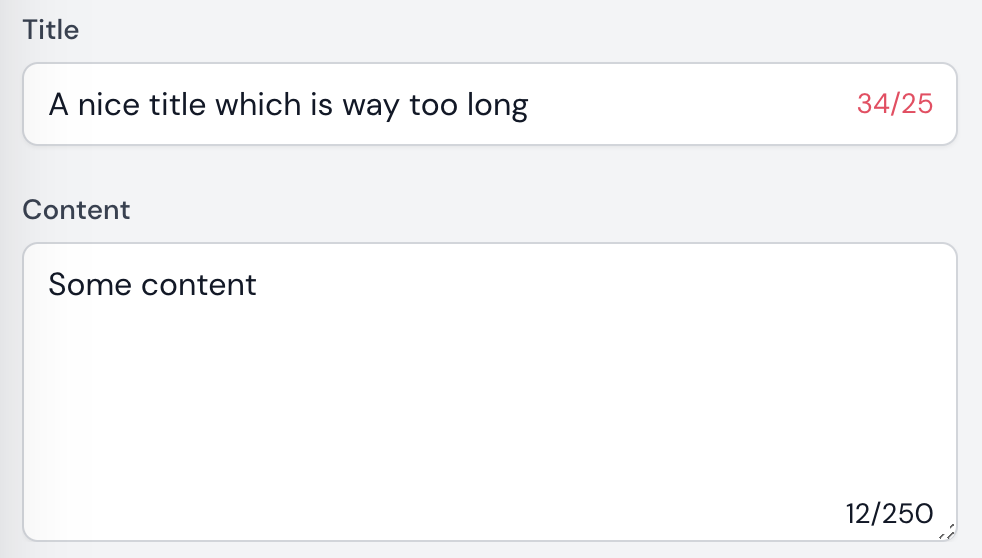

# Filament Char Counter

Show a character counter in a text input or textarea.

TextInput with a 55 max counter, you can exceed the 55 character limit, the counter will turn red.
```php
TextInput::make('title')->characterLimit(55),
```

Textarea with a max length of 55 characters. You can't exceed the 55 character limit.
```php
Textarea::make('content')->maxLength(55),
```


